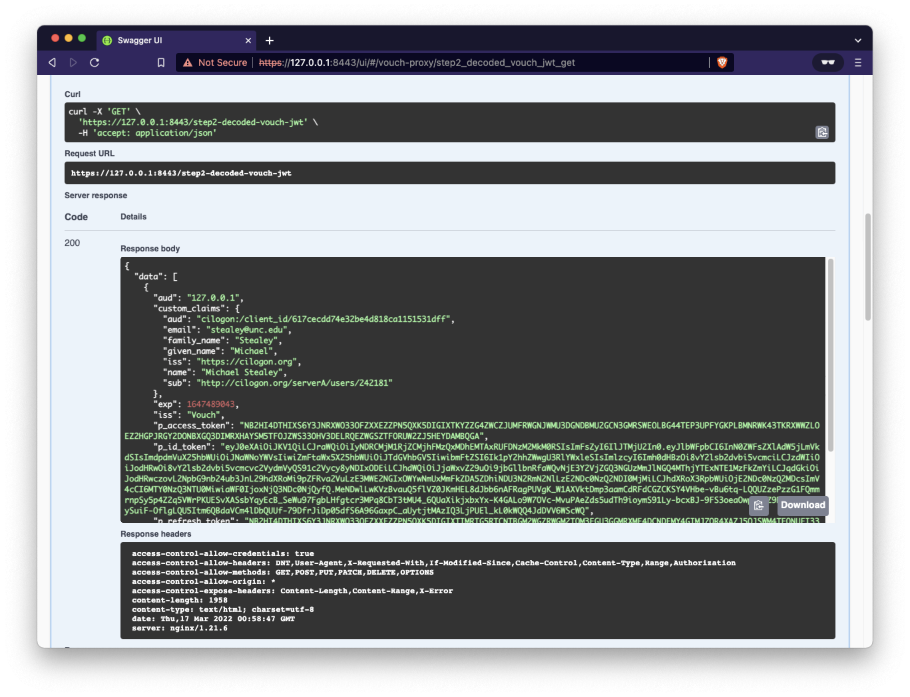

# Vouch Proxy OIDC JWT Demo

Explore how Vouch Proxy encapsulates OIDC authentication data as an encoded JWT

1. Vouch-Proxy JWT stored as base64 encoded gzipped cookie
2. Vouch-Proxy JWT base64 decoded and unzipped (signature alg: HS256)
3. CILogon tokens (access, identity, refresh) - unpacked from JWT (signature alg: RS256)
4. Fully decoded/unpacked JWT with CILogon tokens

**DISCLAIMER: The code herein may not be up to date nor compliant with the most recent package and/or security notices. The frequency at which this code is reviewed and updated is based solely on the lifecycle of the project for which it was written to support, and is not actively maintained outside of that scope. Use at your own risk.**

## Table of Contents

- [What is OpenId Connect (OIDC)?](./docs/what-is-openid-connect.md)
- [How FABRIC uses OpenID Connect](./docs/how-fabric-uses-oidc.md)
- [Demonstration](#demo)
    - [1. Vouch-Proxy JWT stored as base64 encoded gzipped cookie](#step1)
    - [2. Vouch-Proxy JWT base64 decoded and unzipped (signature alg: HS256)](#step2)
    - [3. CILogon tokens (access, identity, refresh) - unpacked from JWT (signature alg: RS256)](#step3)
    - [4. Fully decoded/unpacked JWT with CILogon tokens](#step4) 
- [Configuration](#config)
- [Usage](#usage)
- [References](#references)

## <a name="demo"></a>Demonstration

This demonstration is a simple, but deliberate walk through of the construction of the cookie object generated by Vouch Proxy as it passes encoded OpenID authentication data to a website or service.


When first accessing any of the endpoints the user will will receive a `401 Unauthorized` response


```json
{
  "errors": [
    {
      "details": "Login required: https://127.0.0.1:8443/login",
      "message": "Unauthorized"
    }
  ],
  "size": 1,
  "status": 401,
  "type": "error"
}
```

The `details` portion of the error notifies the user where to login at (e.g. [https://127.0.0.1:8443/login]()). The login page will redirect the user to a CILogon page with a dropdown list of Identity Providers to choose from.


In this case `University of North Carolina at Chapel Hill` was chosen


Authenticate with your institutional credential and you will be redirected back to the demonstration site.

At this point you are ready to go to Step 1.
 

### <a name="step1"></a>1. Vouch-Proxy JWT stored as base64 encoded gzipped cookie

Expand the `/step1...` endpoint, select "Try it out" and "Execute"


The resulting response contains a cookie that has been set in your browser by Vouch Proxy (cookie abbreviated for readability)

```json
{
  "data": [
    {
      "cookie_name": "fabric-service-alpha",
      "cookie_value": "H4sIAAAAAAAA_...f8BAAD__-j6j0VHCQAA"
    }
  ],
  "size": 1,
  "status": 200,
  "type": "vouch.cookie.encoded"
}
```

**What is this "cookie"?**

- Vouch Proxy will receive a JWT from the OpenID provider which varies in size based on the configured scopes and additional requested claims. The data is then:
    - compressed with gzip
    - base64 encoded
    - returned as the "cookie"

This cookie can also be observed in your browser's developer mode.

 

### <a name="step2"></a>2. Vouch-Proxy JWT base64 decoded and unzipped (signature alg: HS256)

Expand the `/step2...` endpoint, select "Try it out" and "Execute"



The resulting response contains the decoded JWT from Vouch Proxy along with the claims, `access_token`, `id_token` and `refresh_token` return by CILogon (tokens and/or JWTs abbreviated for readability)

```json
{
  "data": [
    {
      "aud": "127.0.0.1",
      "custom_claims": {
        "aud": "cilogon:/client_id/617cecdd74e32be4d818ca1151531dff",
        "email": "stealey@unc.edu",
        "family_name": "Stealey",
        "given_name": "Michael",
        "iss": "https://cilogon.org",
        "name": "Michael Stealey",
        "sub": "http://cilogon.org/serverA/users/242181"
      },
      "exp": 1647489043,
      "iss": "Vouch",
      "p_access_token": "NB2HI4DTHIXS6Y3JNRXWO33...FORUW2ZJ5HEYDAMBQGA",
      "p_id_token": "eyJ0eXAiOiJKV1QiLCJ...l_kL0kWQQ4JdDVV6WScWQ",
      "p_refresh_token": "NB2HI4DTHIXS6Y3JNRXWO33...XI2LNMU6TQNRUGAYDAMBQ",
      "username": "stealey@unc.edu"
    }
  ],
  "size": 1,
  "status": 200,
  "type": "vouch.jwt.decoded"
}
```

The result displayed here is the result of:
- base64 decoding the cookie
- decompressing the gzipped JWT
- decoding the JWT with the `HS256` key stored as the Vouch Proxy `secret`

In it's intermediate view the JWT can be copied into [jwt.io]() and viewed as its constituent parts


**What do all these fields mean?**

- `aud`: Audience of the cookie, which is the website or service
- `custom_claims`: from CILogon and set in the Vouch Proxy `config` file
    - `aud`: Audience of the ID Token (scope: openid)
    - `email`: Email address (scope: email)
    - `family_name`: Last Name (scope: profile)
    - `given_name`: First Name (scope: profile)
    - `iss`: Issuer of the ID Token (scope: openid)
    - `name`: Display/Full Name (scope: profile)
    - `sub`: Unique Identifier - User (scope: openid)
- `exp`: Expiration Time - 4 hours (seconds since epoch)
- `iss`: Issuer of the cookie
- `p_access_token`: CILogon Access Token
- `p_id_token`: CILogon ID Token (as JWT)
- `p_refresh_token`: CILogon Refresh Token
- `username`: User name associated to the request

**NOTE**: time (`exp`) is often expressed as an `Integer` that is relative to Epoch (Unix Epoch time is the number of seconds elapsed since 00:00:00 UTC, Thursday, 1 January 1970.). This value can be converted using tools such as [https://www.epochconverter.com](https://www.epochconverter.com)

### <a name="step3"></a>3. CILogon tokens (access, identity, refresh) - unpacked from JWT (signature alg: RS256)

Expand the `/step3...` endpoint, select "Try it out" and "Execute"


The resulting response contains the three CILogon Tokens `access_token`, `identity_token` (as decoded JWT) and `refresh_token` (tokens and/or JWTs abbreviated for readability)

```json
{
  "data": [
    {
      "access_token": "NB2HI4DTHIXS6Y3JNRXWO33...FORUW2ZJ5HEYDAMBQGA",
      "identity_token": {
        "aud": "cilogon:/client_id/617cecdd74e32be4d818ca1151531dff",
        "auth_time": 1647474607,
        "email": "stealey@unc.edu",
        "exp": 1647475542,
        "family_name": "Stealey",
        "given_name": "Michael",
        "iat": 1647474642,
        "iss": "https://cilogon.org",
        "jti": "https://cilogon.org/oauth2/idToken/171a64b19f06e12add09d8b4577df7ce/1647474642423",
        "name": "Michael Stealey",
        "sub": "http://cilogon.org/serverA/users/242181"
      },
      "refresh_token": "NB2HI4DTHIXS6Y3JNRXWO33...XI2LNMU6TQNRUGAYDAMBQ"
    }
  ],
  "size": 1,
  "status": 200,
  "type": "cilogon.tokens"
}
```

In it's intermediate view the `identity_token` JWT can be copied into [jwt.io]() and viewed as its constituent parts

**NOTE**: The appropriate public key must be retrieved from CILogon in order to verify the signature of the JWT ([https://cilogon.org/oauth2/certs](https://cilogon.org/oauth2/certs))


**What do all these fields mean?**

- `access_token`: CILogon Access Token
- `identity_token`: CILogon Identity Token
    - `aud`: Audience of the `id_token`, which is the `client_id` of the OIDC client
    - `auth_time`: Authentication Time - original (seconds since epoch)
    - `email`: Email Address
    - `exp`: Expiration Time - 15 minutes (seconds since epoch)
    - `family_name`: Last Name
    - `given_name`: First Name
    - `iat`: Issued at (seconds since epoch)
    - `iss`: Issuer
    - `jti`: Unique identifier of the JWT
    - `name`: Display/Full Name
    - `sub`: Unique Identifier - User
- `refresh_token`: CILogon Refresh Token

### <a name="step4"></a>4. Fully decoded/unpacked JWT with CILogon tokens

Expand the `/step4...` endpoint, select "Try it out" and "Execute"


The resulting response contains the fully expanded cookie (tokens and/or JWTs abbreviated for readability)

```json
{
  "data": [
    {
      "aud": "127.0.0.1",
      "cilogon_access_token": "NB2HI4DTHIXS6Y3JNRXWO33...FORUW2ZJ5HEYDAMBQGA",
      "cilogon_identity_token": {
        "aud": "cilogon:/client_id/617cecdd74e32be4d818ca1151531dff",
        "auth_time": 1647474607,
        "email": "stealey@unc.edu",
        "exp": 1647475542,
        "family_name": "Stealey",
        "given_name": "Michael",
        "iat": 1647474642,
        "iss": "https://cilogon.org",
        "jti": "https://cilogon.org/oauth2/idToken/171a64b19f06e12add09d8b4577df7ce/1647474642423",
        "name": "Michael Stealey",
        "sub": "http://cilogon.org/serverA/users/242181"
      },
      "cilogon_refresh_token": "NB2HI4DTHIXS6Y3JNRXWO33...XI2LNMU6TQNRUGAYDAMBQ",
      "custom_claims": {
        "aud": "cilogon:/client_id/617cecdd74e32be4d818ca1151531dff",
        "email": "stealey@unc.edu",
        "family_name": "Stealey",
        "given_name": "Michael",
        "iss": "https://cilogon.org",
        "name": "Michael Stealey",
        "sub": "http://cilogon.org/serverA/users/242181"
      },
      "exp": 1647489043,
      "iss": "Vouch",
      "username": "stealey@unc.edu"
    }
  ],
  "size": 1,
  "status": 200,
  "type": "vouch.jwt.fullydecoded"
}
```

## <a name="config"></a>Configuration

Copy the `env.template` file as `.env` and populate according to your environment

- update: `https://127.0.0.1:8443` with your domain
- replace: `vouch-cookie-name-goes-here` with your cookie name
- replace: `vouch-jwt-secret-goes-here` with your Vouch-Proxy secret

```ini
# Configuration

### API
export API_SERVER_URL=https://127.0.0.1:8443
export API_JSON_RESPONSE_INDENT=2

### Vouch-Proxy
export VOUCH_COOKIE_NAME=vouch-cookie-name-goes-here
export VOUCH_JWT_SECRET="vouch-jwt-secret-goes-here"

### Python Path
export PYTHONPATH=$(pwd)/server:${PYTHONPATH}

### Flask
export FLASK_APP=swagger_server.__main__:app
```

Copy the `env.template` file as `.env` and populate according to your environment

- update: values of `127.0.0.1` or `https://127.0.0.1:8443` with your domain
- replace: `vouch-cookie-name-goes-here` with your cookie name
- replace: `vouch-jwt-secret-goes-here` with your Vouch-Proxy secret
- replace: `CILOGON_CLIENT_ID` with your OIDC Client ID
- replace: `CILOGON_CLIENT_SECRET` with your OIDC Client Secret

```ini
# vouch config
# bare minimum to get vouch running with OpenID Connect (such as okta)

vouch:
    logLevel: debug
    # domains:
    # valid domains that the jwt cookies can be set into
    # the callback_urls will be to these domains
    # domains:
    # - yourdomain.com
    # - yourotherdomain.com

    # - OR -
    # instead of setting specific domains you may prefer to allow all users...
    # set allowAllUsers: true to use Vouch Proxy to just accept anyone who can authenticate at the configured provider
    # and set vouch.cookie.domain to the domain you wish to protect
    allowAllUsers: true

    # Setting publicAccess: true will accept all requests, even without a valid jwt/cookie.  - VOUCH_PUBLICACCESS
    # If the user is logged in, the cookie will be validated and the user header will be set.
    # You will need to direct people to the Vouch Proxy login page from your application.
    publicAccess: true

    # in order to prevent redirection attacks all redirected URLs to /logout must be specified
    # the URL must still be passed to Vouch Proxy as https://vouch.yourdomain.com/logout?url=${ONE OF THE URLS BELOW}
    post_logout_redirect_uris:
        # API UI endpoint
        - https://127.0.0.1:8443/ui/#

    jwt:
        # secret - VOUCH_JWT_SECRET
        # a random string used to cryptographically sign the jwt
        # Vouch Proxy complains if the string is less than 44 characters (256 bits as 32 base64 bytes)
        # if the secret is not set here then Vouch Proxy will..
        # - look for the secret in `./config/secret`
        # - if `./config/secret` doesn't exist then randomly generate a secret and store it there
        # in order to run multiple instances of vouch on multiple servers (perhaps purely for validating the jwt),
        # you'll want them all to have the same secret
        secret: vouch-jwt-secret-goes-here

    cookie:
        # allow the jwt/cookie to be set into http://yourdomain.com (defaults to true, requiring https://yourdomain.com)
        secure: false
        # vouch.cookie.domain must be set when enabling allowAllUsers
        domain: 127.0.0.1
        name: vouch-cookie-name-goes-here

    headers:
        jwt: X-Vouch-Token                # VOUCH_HEADERS_JWT
        querystring: access_token         # VOUCH_HEADERS_QUERYSTRING
        redirect: X-Vouch-Requested-URI   # VOUCH_HEADERS_REDIRECT
        claims:
            - aud
            - email
            - family_name
            - given_name
            - iss
            - name
            - oidc
            - sub
            - token_id
        idtoken: X-Vouch-IdP-IdToken
        accesstoken: X-Vouch-IdP-AccessToken
        # refresh token added to OIDC RP Client response by request to CILogon
        refreshtoken: X-Vouch-IdP-RefreshToken

oauth:
    # Generic OpenID Connect
    # including okta
    provider: oidc
    client_id: CILOGON_CLIENT_ID
    client_secret: CILOGON_CLIENT_SECRET
    auth_url: https://cilogon.org/authorize
    token_url: https://cilogon.org/oauth2/token
    user_info_url: https://cilogon.org/oauth2/userinfo
    scopes:
        - openid
        - email
        - profile
    callback_url: https://127.0.0.1:8443/auth
```

## <a name="usage"></a>Usage

### Local Development

Flask is run on host while Vouch-Proxy and Nginx is run in Docker

1. Set up Python virtual environment

    ```console
    virtualenv -p /usr/local/bin/python3 venv
    source venv/bin/activate
    pip install -r requirements.txt
    ```

2. Set the environment variables and pull the images

    ```console
    source .env
    docker-compose pull
    ```

3. Bring up Vouch-Proxy and Nginx

    ```console
    docker-compose up -d nginx vouch-proxy
    ```

4. Run the vouch-proxy-demo-api Flask application

    ```console
    UWSGI_UID=$(id -u) UWSGI_GID=$(id -g) uwsgi --virtualenv ./venv --ini server/vouch-proxy-demo-api.ini
    ```


## <a name="references"></a>References

- Connexion: [https://connexion.readthedocs.io/en/stable/](https://connexion.readthedocs.io/en/stable/)
- Flask: [https://flask.palletsprojects.com](https://flask.palletsprojects.com)
- Flask SQLAlchemy: [https://flask-sqlalchemy.palletsprojects.com](https://flask-sqlalchemy.palletsprojects.com)
- Flask Migrate: [https://flask-migrate.readthedocs.io/en/latest/](https://flask-migrate.readthedocs.io/en/latest/)
- OpenAPI Specification: [https://swagger.io/specification/](https://swagger.io/specification/)
- Swagger: [https://swagger.io](https://swagger.io)
- Epoch Converter: [https://www.epochconverter.com](https://www.epochconverter.com)

