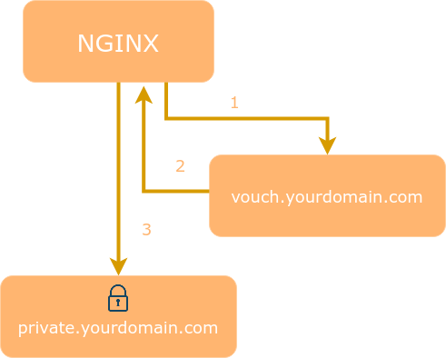
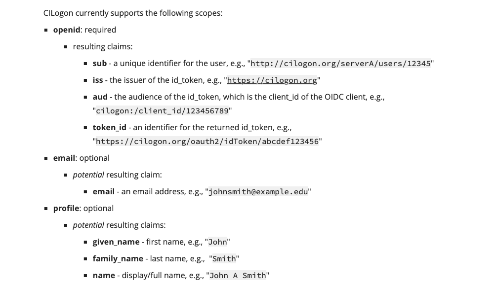
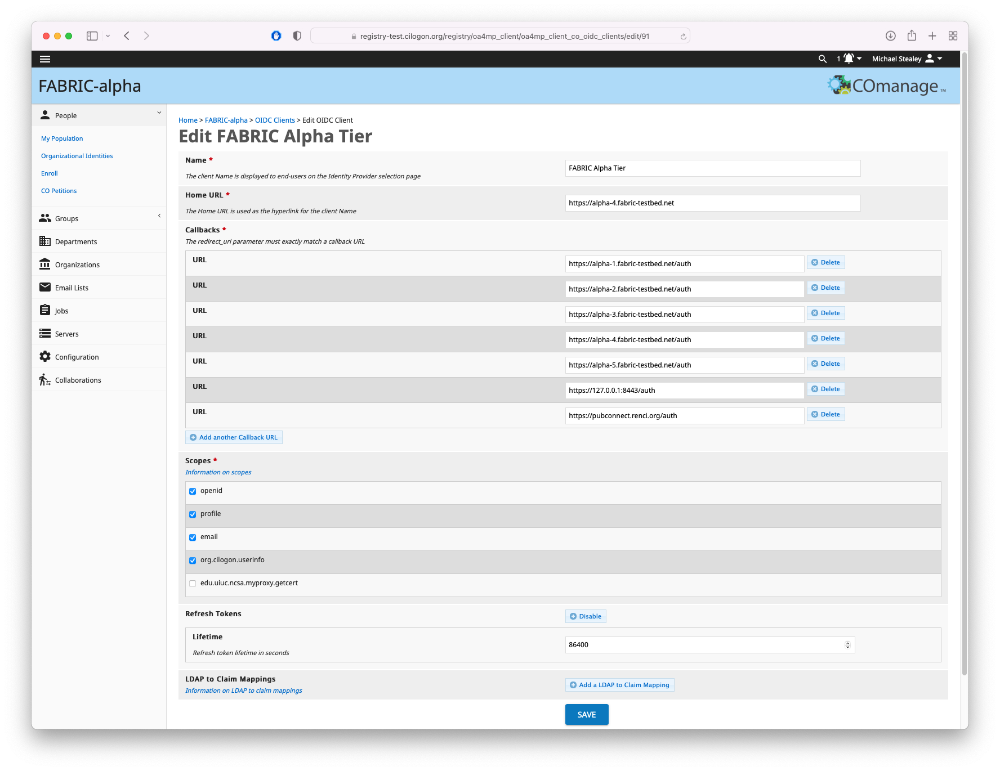

# How FABRIC uses OpenID Connect

## Table of Contents

- [Intro](#intro)
- [Vouch Proxy](#vouch)
- [Configuration](#config)
- [CILogon / COmanage](#cilogon)
- [References](#references)

## <a name="intro"></a>Intro

FABRIC and its underlying services are the Relying Party to the OpenID Connect (OIDC) authentication service provided by CILogon.

CILogon provides an integrated open source identity and access management platform for research collaborations, combining federated identity management (Shibboleth, InCommon) with collaborative organization management (COmanage).

All FABRIC services are additionally fronted by Vouch Proxy to ensure that any entities attempting to access FABRIC's services have valid and up to date permissions.

## <a name="vouch"></a>Vouch Proxy

Vouch Proxy (VP) forces visitors to login and authenticate with an IdP (such as CILogon) before allowing them access to a website or service.



After a visitor logs in Vouch Proxy allows access to the protected websites for several hours. Every request is checked by VP to ensure that it is valid.

VP can send the visitor's email, name and other information which the IdP provides (including access tokens) to the web application as HTTP headers. VP can be used to replace application user management entirely.

## <a name="config"></a>Configuration

Vouch Proxy relies on the ability to share a cookie between the Vouch Proxy server and the application it's protecting. Typically this will be done by running Vouch on a subdomain such as `vouch.yourdomain.com` with apps running at `app1.yourdomain.com` and `app2.yourdomain.com`. The protected domain is `.yourdomain.com` and the Vouch Proxy cookie must be set in this domain by setting [vouch.domains](https://github.com/vouch/vouch-proxy/blob/master/config/config.yml_example#L23-L33) to include yourdomain.com or sometimes by setting [vouch.cookie.domain](https://github.com/vouch/vouch-proxy/blob/master/config/config.yml_example#L81-L82) to `yourdomain.com`.

### Scopes and Claims

With Vouch Proxy you can request various `scopes` (standard and custom) to obtain more information about the user or gain access to the provider's APIs. Internally, Vouch Proxy launches a requests to `user_info_url` after successful authentication. From the provider's response the required `claims` are extracted and stored in the vouch cookie.

### Example `config` file

```yaml
# vouch config
# bare minimum to get vouch running with OpenID Connect (such as okta)

vouch:
    logLevel: debug
    # domains:
    # valid domains that the jwt cookies can be set into
    # the callback_urls will be to these domains
    # domains:
    # - yourdomain.com
    # - yourotherdomain.com

    # - OR -
    # instead of setting specific domains you may prefer to allow all users...
    # set allowAllUsers: true to use Vouch Proxy to just accept anyone who can authenticate at the configured provider
    # and set vouch.cookie.domain to the domain you wish to protect
    allowAllUsers: true

    # Setting publicAccess: true will accept all requests, even without a valid jwt/cookie.  - VOUCH_PUBLICACCESS
    # If the user is logged in, the cookie will be validated and the user header will be set.
    # You will need to direct people to the Vouch Proxy login page from your application.
    publicAccess: true

    # in order to prevent redirection attacks all redirected URLs to /logout must be specified
    # the URL must still be passed to Vouch Proxy as https://vouch.yourdomain.com/logout?url=${ONE OF THE URLS BELOW}
    post_logout_redirect_uris:
        # API UI endpoint
        - https://127.0.0.1:8443/ui/#

    jwt:
        # secret - VOUCH_JWT_SECRET
        # a random string used to cryptographically sign the jwt
        # Vouch Proxy complains if the string is less than 44 characters (256 bits as 32 base64 bytes)
        # if the secret is not set here then Vouch Proxy will..
        # - look for the secret in `./config/secret`
        # - if `./config/secret` doesn't exist then randomly generate a secret and store it there
        # in order to run multiple instances of vouch on multiple servers (perhaps purely for validating the jwt),
        # you'll want them all to have the same secret
        secret: vouch-jwt-secret-goes-here

    cookie:
        # allow the jwt/cookie to be set into http://yourdomain.com (defaults to true, requiring https://yourdomain.com)
        secure: true
        # vouch.cookie.domain must be set when enabling allowAllUsers
        domain: 127.0.0.1
        name: vouch-cookie-name-goes-here

    headers:
        jwt: X-Vouch-Token                # VOUCH_HEADERS_JWT
        querystring: access_token         # VOUCH_HEADERS_QUERYSTRING
        redirect: X-Vouch-Requested-URI   # VOUCH_HEADERS_REDIRECT
        claims:
            - aud                         # Scope: openid.aud
            - email                       # Scope: email.email
            - family_name                 # Scope: profile.family_name
            - given_name                  # Scope: profile.given_name
            - iss                         # Scope: openid.iss
            - name                        # Scope: profile.name
            - oidc                        # Scope: org.cilogon.userinfo.oidc (not configured)
            - sub                         # Scope: openid.sub
            - token_id                    # Scope: openid.token_id
        idtoken: X-Vouch-IdP-IdToken
        accesstoken: X-Vouch-IdP-AccessToken
        # refresh token added to OIDC RP Client response by request to CILogon
        refreshtoken: X-Vouch-IdP-RefreshToken  # patch added by Komal

oauth:
    # Generic OpenID Connect
    # including okta
    provider: oidc
    client_id: CILOGON_CLIENT_ID          # CILogon OIDC client
    client_secret: CILOGON_CLIENT_SECRET  # CILogon OIDC client
    auth_url: https://cilogon.org/authorize
    token_url: https://cilogon.org/oauth2/token
    user_info_url: https://cilogon.org/oauth2/userinfo
    scopes:
        - openid                          # CILogon scope
        - email                           # CILogon scope
        - profile                         # CILogon scope
    callback_url: https://127.0.0.1:8443/auth
```

Additional headers set in Nginx

```conf
location / {
    # forward authorized requests to your service protectedapp.yourdomain.com
    ...
    proxy_set_header Host $host;
    proxy_set_header X-Real-IP $remote_addr;
    
    ### AUTH REQUEST SET ###
    # you may need to set these variables in this block as per https://github.com/vouch/vouch-proxy/issues/26#issuecomment-425215810
    auth_request_set $auth_resp_x_vouch_user $upstream_http_x_vouch_user;
    
    # optinally add X-Vouch-IdP-IdToken, X-Vouch-IdP-AccessToken or X-Vouch-IdP-RefreshToken
    auth_request_set $auth_resp_x_vouch_idp_idtoken $upstream_http_x_vouch_idp_idtoken;
    auth_request_set $auth_resp_x_vouch_idp_accesstoken $upstream_http_x_vouch_idp_accesstoken;
    auth_request_set $auth_resp_x_vouch_idp_refreshtoken $upstream_http_x_vouch_idp_refreshtoken;
    
    ### PROXY SET HEADER ###
    # optionally pass any custom claims you are tracking
    # set user header (usually an email)
    proxy_set_header X-Vouch-User $auth_resp_x_vouch_user;
    
    # optionally pass the idtoken, accesstoken or refreshtoken
    proxy_set_header X-Vouch-IdP-IdToken $auth_resp_x_vouch_idp_idtoken;
    proxy_set_header X-Vouch-IdP-AccessToken $auth_resp_x_vouch_idp_accesstoken;
    proxy_set_header X-Vouch-IdP-RefreshToken $auth_resp_x_vouch_idp_refreshtoken;
}
```

## <a name="cilogon"></a>CILogon / COmanage

CILogon provides a standards-compliant OpenID Connect (OAuth 2.0) interface to federated authentication for cyberinfrastructure (CI).

We recommend using a Certified OpenID Connect Implementation when connecting to CILogon. We plan to obtain OpenID Certification for CILogon's OIDC implementation in the future.

### Scopes

Please configure your client to request only the scope(s) it requires. CILogon will prompt users to approve release of their information to your client. The less information your client requests (via fewer scopes), the more likely users are to approve. Also note that your client can request AT MOST the scopes that are registered, i.e., the "set intersection" of requested scopes and registered scopes is calculated for the set of returned claims. If you need additional scopes after you have registered your client, please email help@cilogon.org for assistance.



### Register an OIDC Client



Example: OIDC client credentials

```
CLIENT_ID: cilogon:/client_id/4d7ea583dd0619c290eda7ab66f2cefa
CLIENT_SECRET: xxxXXXXxxxxXXXXxxxxXXXXxxxxXXXXxxxx
```

## <a name="references"></a>References

- Vouch Proxy: [https://github.com/fabric-testbed/vouch-proxy](https://github.com/fabric-testbed/vouch-proxy)
- CILogon OIDC: [https://www.cilogon.org/oidc](https://www.cilogon.org/oidc)
