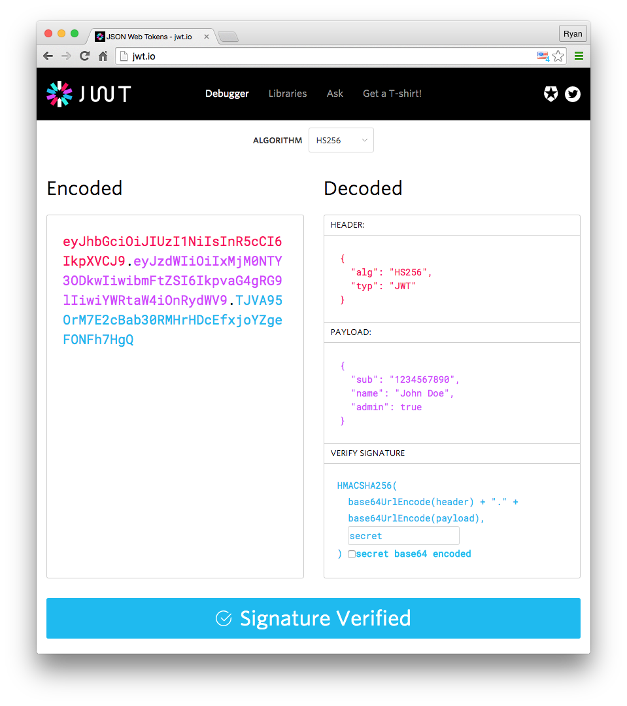

# What is OpenId Connect (OIDC)?

## Table of Contents

- [Intro](#intro)
- [What is OAuth 2.0](#oauth2)
- [What is a JWT](#jwt)
- [OIDC vs. OAuth2](#vsoauth2)
- [OIDC and JWTs](#andjwts)
- [Key Concepts: Scopes, Claims, and Response Types](#concepts)
- [All About Tokens](#tokens)
- [References](#references)

## <a name="intro"></a>Intro

OpenID Connect (OIDC) is an identity layer built on top of the OAuth 2.0 framework. It allows third-party applications to verify the identity of the end-user and to obtain basic user profile information. OIDC uses [JSON web tokens](https://jwt.io/introduction/) (JWTs), which you can obtain using flows conforming to the OAuth 2.0 specifications.

OIDC was developed by the [OpenID Foundation](https://openid.net/connect/), which includes companies like Google and Microsoft. While [OAuth 2.0 is an authorization protocol](https://auth0.com/docs/videos/learn-identity/02-oidc-and-oauth), OIDC is an identity authentication protocol and may be used to verify the identity of a user to a client service, also called Relying Party. In addition, users’ claims like, for example, name, email address, etc., may also be shared on request.

## <a name="oauth2"></a>What is OAuth 2.0

[OAuth 2.0](https://tools.ietf.org/html/rfc6749), which stands for “Open Authorization”, is a standard designed to allow a website or application to access resources hosted by other web apps on behalf of a user. It replaced OAuth 1.0 in 2012 and is now the de facto industry standard for online authorization. OAuth 2.0 provides consented access and restricts actions of what the client app can perform on resources on behalf of the user, without ever sharing the user's credentials.

Although the web is the main platform for OAuth 2, the specification also describes how to handle this kind of delegated access to other client types (browser-based applications, server-side web applications, native/mobile apps, connected devices, etc.)

### Principles of OAuth 2.0

OAuth 2.0 is an authorization protocol and NOT an authentication protocol. As such, it is designed primarily as a means of granting access to a set of resources, for example, remote APIs or user’s data.

OAuth 2.0 uses Access Tokens. An **Access Token** is a piece of data that represents the authorization to access resources on behalf of the end-user. OAuth 2.0 doesn’t define a specific format for Access Tokens. However, in some contexts, the JSON Web Token (JWT) format is often used. This enables token issuers to include data in the token itself. Also, for security reasons, Access Tokens may have an expiration date.

### OAuth 2.0 Access Tokens and Authorization Code

The OAuth 2 Authorization server may not directly return an Access Token after the Resource Owner has authorized access. Instead, and for better security, an **Authorization Code** may be returned, which is then exchanged for an Access Token.  In addition, the Authorization server may also issue a [Refresh Token](https://auth0.com/blog/refresh-tokens-what-are-they-and-when-to-use-them/) with the Access Token. Unlike Access Tokens, **Refresh Tokens** normally have long expiry times and may be exchanged for new Access Tokens when the latter expires. Because Refresh Tokens have these properties, they have to be stored securely by clients.

## <a name="jwt"></a>What is a JWT

JSON Web Token (JWT) is an open standard ([RFC 7519](https://datatracker.ietf.org/doc/html/rfc7519)) that defines a compact and self-contained way for securely transmitting information between parties as a JSON object. This information can be verified and trusted because it is digitally signed. JWTs can be signed using a secret (with the HMAC algorithm) or a public/private key pair using RSA or ECDSA.

In its compact form, JSON Web Tokens consist of three parts separated by dots (`.`), which are:

- **Header** - The header typically consists of two parts: the type of the token, which is JWT, and the signing algorithm being used, such as HMAC SHA256 or RSA.
- **Payload** - The second part of the token is the payload, which contains the claims. Claims are statements about an entity (typically, the user) and additional data. There are three types of claims: registered, public, and private claims.
- **Signature** - To create the signature part you have to take the encoded header, the encoded payload, a secret, the algorithm specified in the header, and sign that.

A JWT typically looks like the following.

`xxxxx.yyyyy.zzzzz`

There are online resources such as [https://jwt.io](https://jwt.io) that can help visualize and validate JWTs.



## <a name="vsoauth2"></a>OIDC vs. OAuth2

While OAuth 2.0 is about resource access and sharing, OIDC is about user authentication. Its purpose is to give you one login for multiple sites. Each time you need to log in to a website using OIDC, you are redirected to your OpenID site where you log in, and then taken back to the website. For example, if you chose to sign in to CILogon using your UNC account then you used OIDC. Once you successfully authenticate with UNC and authorize CILogon to access your information, UNC sends information back to CILogon about the user and the authentication performed. This information is returned in a JWT. You'll receive an access token and if requested, an ID token.

## <a name="andjwts"></a>OIDC and JWTs

JWTs contain claims, which are statements (such as name or email address) about an entity (typically, the user) and additional metadata. The OpenID Connect specification defines a set of standard claims. The set of standard claims include name, email, gender, birth date, and so on. However, if you want to capture information about a user and there currently isn't a standard claim that best reflects this piece of information, you can create custom claims and add them to your tokens.

## <a name="concepts"></a>Key Concepts: Scopes, Claims, and Response Types

There are two primary actors involved in all OIDC interactions: 

- **OpenID Provider (OP)** - The OP is an OAuth 2.0 server that is capable of authenticating the end-user and providing information about the result of the authentication and the end-user to the Relying Party
- **Relying Party (RP)** - The Relying Party is an OAuth 2.0 application that “relies” on the OP to handle authentication requests.

Typically, you kick off an OIDC interaction by hitting an `/authorization` endpoint with an HTTP GET. A number of query parameters indicate what you can expect to get back after authenticating and what you’ll have access to (authorization).

Often, you’ll need to hit a `/token` endpoint with an HTTP POST to get tokens which are used for further interactions.

OIDC also has an `/introspect` endpoint for verifying a token, a `/userinfo` endpoint for getting identity information about the user.

All of the above endpoints are the convention, but can be defined by the OP to be anything. One of the great improvements in OIDC is a metadata mechanism to discover endpoints from the provider. For instance, if you navigate to: [https://cilogon.org/.well-known/openid-configuration](https://cilogon.org/.well-known/openid-configuration), you’ll get back a JSON formatted document with the metadata that identifies all the available endpoints from the OP (CILogon, in this case).

### What’s a Scope?

Scopes are space-separated lists of identifiers used to specify what access privileges are being requested. Valid scope identifiers are specified in [RFC 6749](https://tools.ietf.org/html/rfc6749).

OIDC has a number of built in scope identifiers. `openid` is a required scope. All others – including custom scopes – are optional. Some examples of custom scopes:

scope | purpose
:-----|:-------
`profile` | requests access to default profile claims
`email` | requests access to email and email_verified claims

### What’s a Claim?

Claims are name/value pairs that contain information about a user, as well meta-information about the OIDC service. The official definition from the spec is a [“piece of information asserted about an Entity.”](http://openid.net/specs/openid-connect-core-1_0.html#Terminology)

Here’s typical set of claims:

```json
{
    "aud": "cilogon:/client_id/617cecdd74e32be4d818ca1151531dff",
    "email": "stealey@unc.edu",
    "family_name": "Stealey",
    "given_name": "Michael",
    "iss": "https://cilogon.org",
    "name": "Michael Stealey",
    "sub": "http://cilogon.org/serverA/users/242181"
}
```

### What’s a Response Type?

When working with OIDC, you’ll hear talk of various “flows”. These flows are used to describe different common authentication and authorization scenarios. Considerations include the type of application (like web-based or native mobile app), how you want to validate tokens (in the app or in the backend), and how you want to access additional identity information (make another API call or have it encoded right into a token).

There are three primary flows: **Authorization Code**, **Implicit**, and **Hybrid**. These flows are controlled by the `response_type` query parameter in the `/authorization` request. When thinking of which flow to use, consider front-channel vs. back-channel requirements. Front-channel refers to a user-agent (such as a SPA or mobile app) interacting directly with the OpenID provider (OP). The implicit flow is a good choice when front-channel communication is required. Back-channel refers to a middle-tier client (such as Spring Boot or Express) interacting with the OP. The authorization code flow is a good choice when back-channel communication is required.

- **Authorization Code** flow uses `response_type=code`. After successful authentication, the response will contain a `code` value. This code can later be exchanged for an `access_token` and an `id_token`. This flow is useful where you have “middleware” as part of the architecture. The middleware has a `client id` and `client secret`, which is required to exchange the `code` for tokens by hitting the `/token` endpoint. These tokens can then be returned to the end-user application, such as a browser, without the browser ever having to know the `client secret`. This flow allows for long-lived sessions through the use of `refresh tokens`. The only purpose of refresh tokens is to obtain new `access tokens` to extend a user session.

- **Implicit** flow uses `response_type=id_token token` or `response_type=id_token`. After successful authentication, the response will contain an `id_token` and an `access_token` in the first case or just an `id_token` in the second case. This flow is useful when you have an app speaking directly to a backend to obtain tokens with no middleware. It does not support long-lived sessions.

- **Hybrid** flow combines the above two in different combinations – whatever make sense for the use case. An example would be `response_type=code id_token`. This approach enables a scenario whereby you can have a long lived session in an app and get tokens back immediately from the `/authorization` endpoint.

**NOTE**: CILogon supports

```json
"response_types_supported": [
    "code",
    "id_token"
]
```

## <a name="tokens"></a>All About Tokens

With the foundation of scopes, claims, and response types, we can now talk about tokens! There are three types of tokens in OIDC: id_token, access_token and refresh_token.

### ID Tokens

An `id_token` is a JWT, per the OIDC Specification. This means that:

- identity information about the user is encoded right into the token and
- the token can be definitively verified to prove that it hasn’t been tampered with.

There’s a set of rules in the specification for validating an `id_token`. Among the claims encoded in the `id_token` is an expiration (`exp`), which must be honored as part of the validation process. Additionally, the signature section of JWT is used in concert with a key to validate that the entire JWT has not been tampered with in any way.

### Access Tokens

Access tokens are used as bearer tokens. A bearer token means that the bearer can access authorized resources without further identification. Because of this, it’s important that bearer tokens are protected. If I can somehow get ahold of and “bear” your access token, I can masquerade as you.

These tokens usually have a short lifespan (dictated by its expiration) for improved security. That is, when the access token expires, the user must authenticate again to get a new access token limiting the exposure of the fact that it’s a bearer token.

Although not mandated by the OIDC spec, Okta uses JWTs for access tokens as (among other things) the expiration is built right into the token.

OIDC specifies a `/userinfo` endpoint that returns identity information and must be protected. Presenting the access token makes the endpoint accessible.

### Refresh Tokens

Refresh tokens are used to obtain new access tokens. Typically, refresh tokens will be long-lived while access tokens are short-lived. This allows for long-lived sessions that can be killed if necessary. Here’s a typical scenario:

1. User logs in and gets back an access token and a refresh token
2. The application detects that the access token is expired
3. The application uses the refresh token to obtain a new access token
4. Repeat 2 and 3 until the refresh token expires
5. After the refresh token expires, the user must authenticate again

This approach strikes a balance between user experience and security. Imagine if the user is compromised in some way. Or, their subscription expires. Or, they are fired. At any point, the refresh token can be revoked by an admin. Then, step three above will fail and the user will be forced to (attempt to) establish a new session by authenticating. If their account has been suspended, they will not be able to authenticate.

### Identifying Token Types

It can be confusing sometimes to distinguish between the different token types. Here’s a quick reference:

- **ID tokens** carry identity information encoded in the token itself, which must be a JWT
- **Access tokens** are used to gain access to resources by using them as bearer tokens
- **Refresh tokens** exist solely to get more access tokens


## <a name="references"></a>References

- CILogon: [https://www.cilogon.org/oidc](https://www.cilogon.org/oidc)
- Auth0: [https://auth0.com/intro-to-iam/what-is-openid-connect-oidc/](https://auth0.com/intro-to-iam/what-is-openid-connect-oidc/)
- Okta: [https://developer.okta.com/blog/2017/07/25/oidc-primer-part-1](https://developer.okta.com/blog/2017/07/25/oidc-primer-part-1)
- jwt.io: [https://jwt.io](https://jwt.io)
